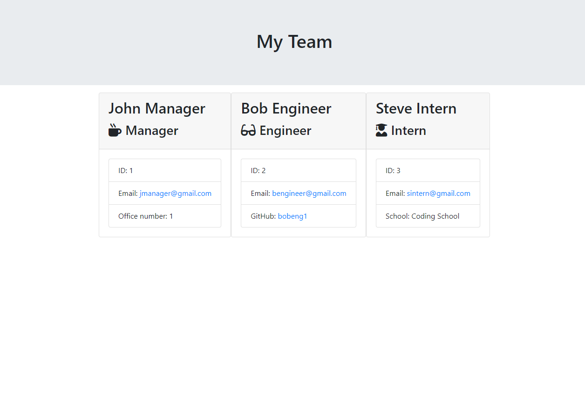

# Team Profile Generator

## Description

The purpose of this app is to easily add employees and their information to a team which is then displayed on a webpage.

## Table of Contents

* [Installation](#installation)

* [Usage](#usage)

* [License](#license)

* [Contributing](#contributing)

* [Tests](#tests)

* [Page preview](#page-preview)

* [Questions](#questions)

## Installation

To install the required dependencies in order to run this project, please first run the command:
~~~
npm i
~~~

## Usage

To use this program, the user must first run the previously stated command, npm i, in order to install all the required dependencies. Once this has been done, run the program with the command: node index.js and answer the questions when prompted.

## License

This project is licensed under: MIT License

## Contributing

To contribute to this project, create a fork of the repo and then submit a pull request.

## Tests

To test this project, please run the command:
~~~
npm test
~~~

## Page Preview

## Questions

For any questions relating to this project please contact using the following links:

GitHub: [gthornbuckle](https://github.com/gthornbuckle/)

Email: gthornbuckle@gmail.com
